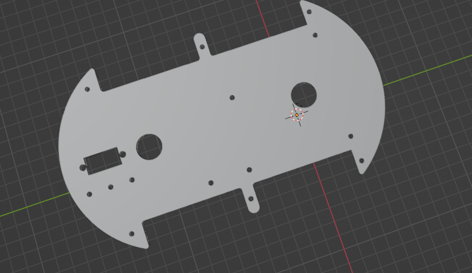
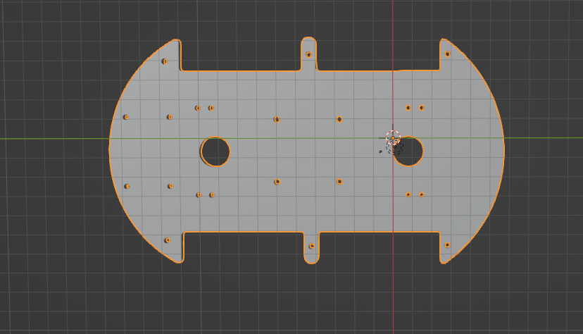
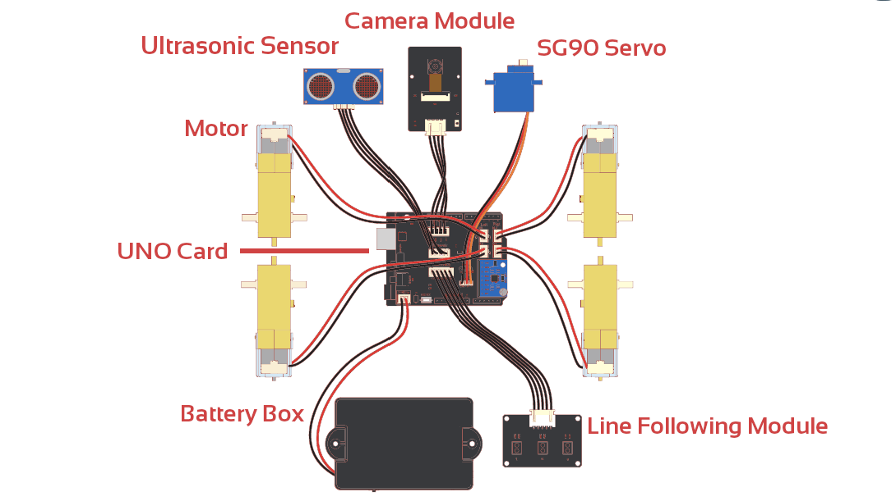

# NanoScarlet

## Description
L'objectif de ce projet est la construction d'un robot 4 roues, capable d'effectuer les deplacement simple, sur surface plane (nord, sud, est et ouest). Tout en proposant certain mode de déplacement spécifique, tel que :
* Le suivi de ligne
* La gestion des obstacle
* Le suivi automatique

## Fabrication

### Matériel nécessaire
* Plaque supérieure et inferieure (imprimer en 3D)
* Support de module ultrason (imprimer en 3D)
* Support caméra
* Moteur de roue (x4)
* Boite de piles
* Pneu (x4)
* Module caméra
* Capteur Ultrason
* IO Carte d'extension
* Carte UNO (x1)
* GY-521
* Module de guidage linéaire
* SG90 Servo (x1)

### Modèle 3D

### Schéma de câblage général

### Bibliothèque utilisée
* ArduinoJSON
* I2Cdev
* IRemote (fourni par ELEGOO)
* MPU6050
* FastLED
* NewPing (pour le partage de la sortie caméra)
* pitches

# Credits
*[DIY Builder](https://www.youtube.com/@DIYBuilder)
*[Prateek Verma](https://www.youtube.com/@prateekverma22)
*[ELEGOO] (https://www.elegoo.com)